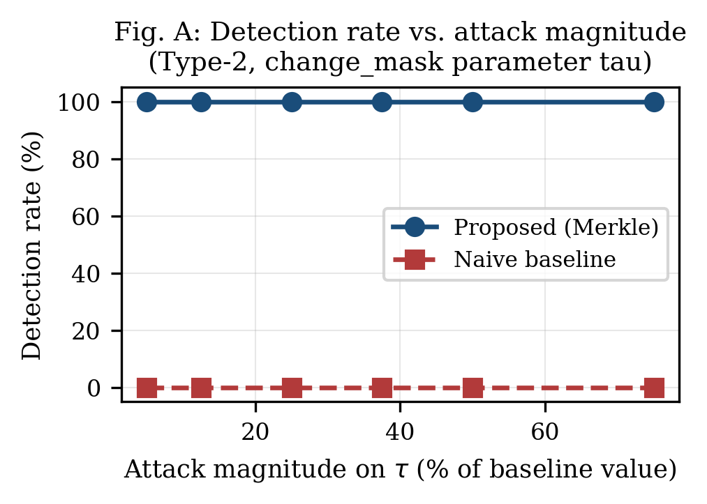
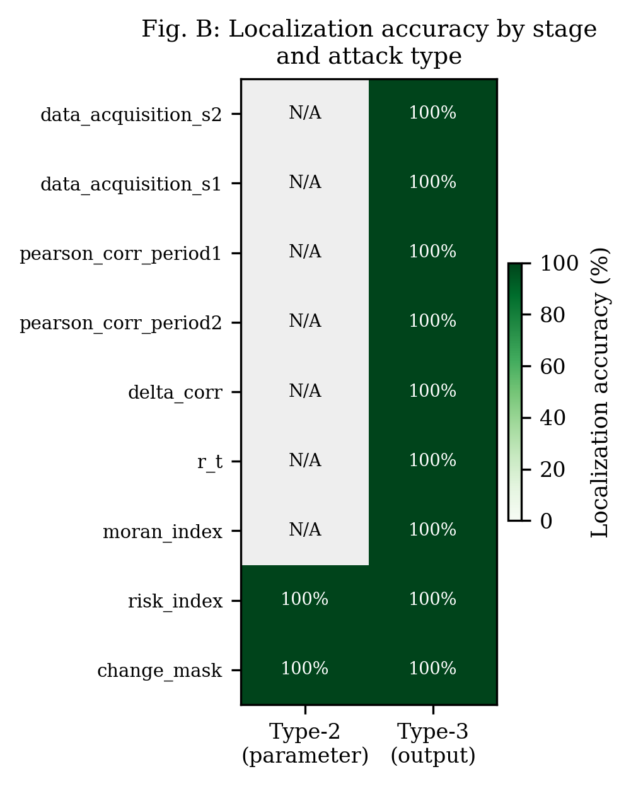
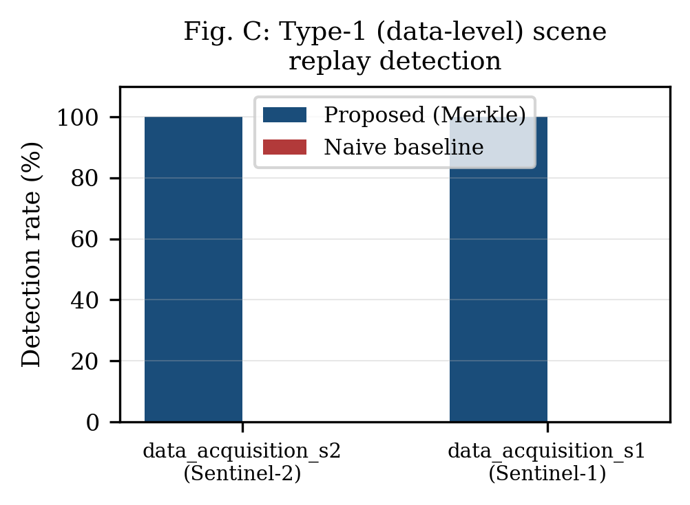
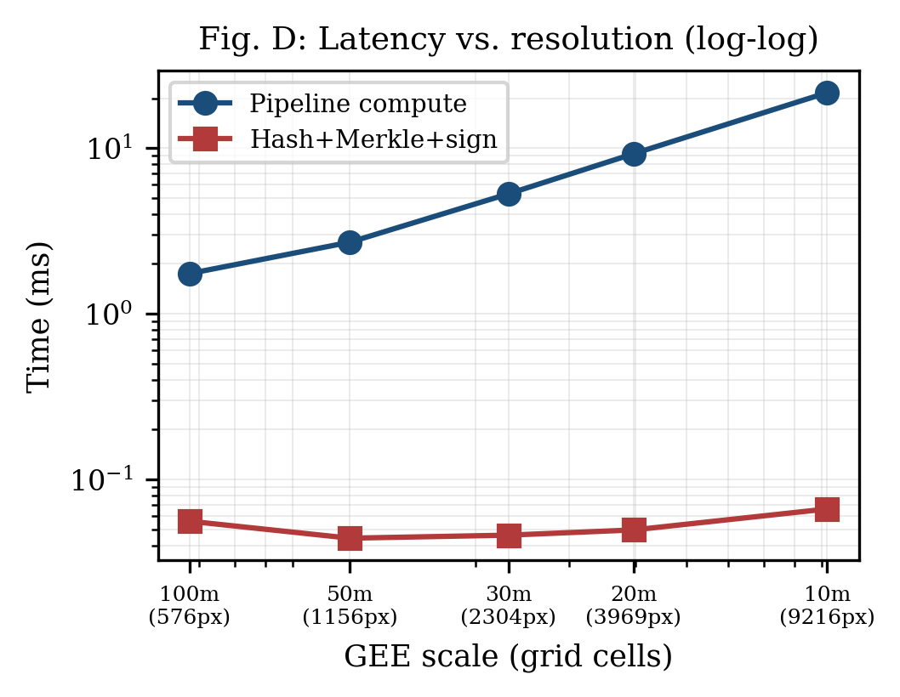
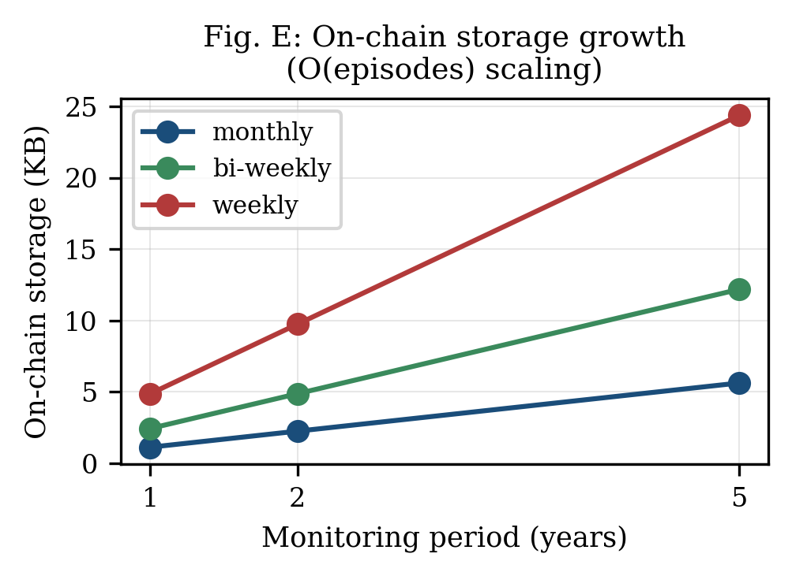
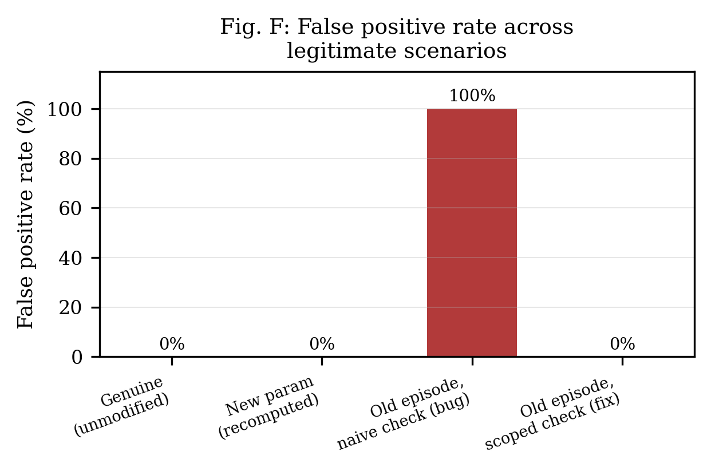

# Provenance PoC: Merkle-anchored multi-level audit layer (BSS2026)

This is a proof of concept implementation for the project brief, Section 6. It does not deploy a real Hyperledger Fabric network. Instead it is a Python implementation of the same logical structure described in Section 4.1, so the central tamper-detection experiment and the naive-baseline comparison can be run and reported honestly. The Limitations section of the paper should state that a full permissioned-ledger deployment is future work.

## Files

`merkle.py` builds a binary Merkle tree and generates and verifies proofs. It also localizes which stage caused a mismatch.

`ledger.py` is an append-only, hash-chained, ECDSA-signed log that simulates a smart contract. It stores only roots and governance transactions.

`pipeline.py` is a reproducible synthetic stand-in for the real GEE script. It uses the same ALPHA, BETA, LAMBDA and TAU constants and the same stage sequence: Pearson r, delta_corr, r_t, Moran's I, risk_index, change_mask. It uses the same leaf hash formula, H_i = SHA256(input_ref, params_i, output_i, operator_DID, timestamp).

`demo_tamper_detection.py` is the central experiment. It anchors a baseline episode, records a legitimate governance transaction, runs Attack Type 2 (parameter level) and Attack Type 3 (output level), compares against the naive baseline, and checks ledger integrity.

`benchmark.py` measures overhead across 5 simulated scales (100m, 50m, 30m, 20m, 10m as a resolution proxy), projects storage cost over different monitoring periods, and measures end to end verification latency (proof generation and proof verification time). It writes `benchmark_results.json`.

`attack_sweep.py` runs an attack sensitivity sweep. It applies Type 1, Type 2 and Type 3 attacks across every applicable stage and a grid of magnitudes, over 40 random seeds per combination. It writes `attack_sweep_results.json`. It also runs a combined attack check (Type 2 and Type 3 in the same episode) and writes `combined_attack_results.json`.

`fp_sweep.py` runs a false positive rate sweep across 4 legitimate activity scenarios. This is how a real bug was found: an earlier check compared an episode's recorded governance parameter against the ledger's current state instead of its state as of the episode's own timestamp, so it wrongly flagged legitimately anchored older episodes after a later, valid governance change. The fix is `ledger.py`'s `params_as_of` method. It writes `fp_sweep_results.json`.

`make_figures.py` renders Figures A through F at 300 DPI using a serif font, from the three JSON result files above.

`gee_extract.py` is a Python translation of the original JS pipeline using the `earthengine-api` package. Run it on a machine with real Earth Engine access to produce `real_episode_data.json` from actual Sentinel-1/2 data.

`gee_extract.js` and `load_real_episode_from_csv.py` are a browser based fallback for when `earthengine-api` OAuth is blocked for the account or project. The JS file runs in the Earth Engine Code Editor and exports 3 CSV files. The Python loader rebuilds the same `real_episode_data.json` shape from them.

`load_real_episode.py` loads `real_episode_data.json`, anchors it, and runs the same attack and naive baseline experiment as `demo_tamper_detection.py`, but on real data.

`architecture.dot` is a Graphviz source file for the updated 5-layer architecture diagram. It adds a Sensitivity Testing Harness node and a dashed box around the three attack types. It is not rendered to an image here because no local `dot` binary is installed.

`HYPERLEDGER_FABRIC_MAPPING.md` is a design level mapping of `ledger.py`'s interface onto a Hyperledger Fabric chaincode: state model, function table, an illustrative Go sketch, and an honest list of what a real Fabric deployment adds that this PoC does not claim.

`FIGURE_CAPTIONS.md` has ready to paste captions for Figures A through F, a replacement paragraph for the tamper detection section, and Limitations wording for the bugs that were found and fixed. `BSS2026_Provenance_Paper.docx` was not found on this machine, so none of this text has actually been inserted into the paper yet.

`evaluation_summary.json` and `real_episode_evaluation.json` are machine readable output from the demo run, on synthetic data and on real Sentinel-1/2 data respectively.

## Figures

Fig. A shows detection rate against attack magnitude for a Type 2 attack on `change_mask`'s tau. The proposed scheme stays at 100% detection at every magnitude tested. The naive baseline stays at 0%, since it never inspects tau at all.



Fig. B is a heatmap of localization accuracy by pipeline stage and attack type. Type 2 attacks are only naturally defined for `risk_index` and `change_mask`, so the other cells under that column are marked N/A rather than measured as zero.



Fig. C shows Type 1 (data level) scene replay detection for the two data acquisition stages.



Fig. D plots pipeline compute time against hash, Merkle and sign overhead across the 5 simulated resolutions, on a log log scale.



Fig. E plots projected on-chain storage over a 1, 2 and 5 year monitoring period at three monitoring cadences.



Fig. F shows the false positive rate across the four legitimate activity scenarios from `fp_sweep.py`, including the bug and the fix described above.



## Why the pipeline runs on synthetic data

This machine has no Earth Engine authentication and no network access to `earthengine.googleapis.com` in every session so far. Rather than fake numbers, `pipeline.py` implements the actual math: per-pixel Pearson correlation across a time stack, a 3x3 non-self convolution kernel for Moran's I, and the same weighted risk index. It runs this over a small synthetic raster with an injected hidden change patch (NDVI stable, SAR shifted, the exact decoupling signal the original method targets), seeded for full reproducibility. The paper should describe this as an offline reproducibility harness for the provenance layer evaluation, separate from the underlying SIST 2026 method, which is already validated and should be cited as prior work in third person only.

## Known limitations to state in the paper

There is no real Hyperledger Fabric or Caliper benchmark. This is a local append-only structure with the same interface a smart contract would expose: append, verify_chain, and governance gated parameter changes. See `HYPERLEDGER_FABRIC_MAPPING.md` for the function by function mapping and the specific things a real deployment adds, such as distributed consensus, peer replication, and a separation of duty endorsement policy for governance transactions.

DID is simplified to a bare ECDSA keypair plus a string identifier, not a W3C DID document or resolver. On a real Fabric deployment this maps naturally onto MSP client certificate identity. This is a legitimate simplification to state rather than a gap.

Overhead numbers from `benchmark.py` are sandbox relative: one machine, no real network or consensus latency. Report the trend instead, since overhead shrinks as pixel count grows because hashing touches per-stage summaries rather than every pixel, instead of claiming these millisecond values transfer to a real Fabric deployment.

The raster is synthetic rather than live Sentinel-1/2 data by default. The leaf hash mechanism is identical to what would run against real GEE outputs. Only the pixel values are simulated. A real episode has been run once through the Code Editor fallback path and is stored in `real_episode_data.json`.

## Bugs found and fixed during evaluation

The sensitivity sweeps in this PoC were written specifically to look for failure modes, not just to confirm expected behavior, and they found two real bugs.

The false positive sweep in `fp_sweep.py` found that the parameter cross-check used in `demo_tamper_detection.py` compares an episode against the ledger's current governance state. That means any episode anchored before a later, legitimate parameter change gets wrongly flagged once that change is recorded, even though nothing was tampered with. The fix is `ledger.py`'s `params_as_of(timestamp)` method, which replays governance history only up to the episode's own timestamp. After the fix, the false positive rate is 0% across all four tested scenarios.

The combined attack check in `attack_sweep.py` found that `MerkleTree.find_mismatched_stage` only returns the first mismatched stage it finds, so a simultaneous attack on two stages would only ever get one of them named. The fix is a new `find_all_mismatched_stages` method in `merkle.py`, which correctly names both tampered stages in every trial.

## Running the synthetic experiments

No external network access is required for any of these. Only `numpy` and `cryptography` are needed beyond the standard library, both listed in `requirements.txt`.

```bash
python3 demo_tamper_detection.py   # central tamper-detection experiment
python3 benchmark.py              # overhead, storage, and verification latency
python3 attack_sweep.py           # attack sensitivity sweep and combined-attack check
python3 fp_sweep.py               # false positive rate sweep
python3 make_figures.py           # renders Fig. A through F from the JSON above
```

## Plugging in the real GEE pipeline

If the machine you are on can reach `earthengine.googleapis.com`, install `earthengine-api` and run `earthengine authenticate` once. This needs a Google Cloud project with the Earth Engine API enabled and registered for EE access, the same requirement as the JS Code Editor. Then run:

```bash
python3 gee_extract.py --project YOUR_GCP_PROJECT_ID
```

This is a line by line translation of the original JS script: `maskS2clouds`, `getData`, the 15 day join, Pearson corr1 and corr2, delta_corr, r_t, the Moran's I convolution, risk_index, and change_mask. For each stage it computes the same `reduceRegion` mean as the original sensitivity analysis block, plus a deterministic sample based `array_hash` from 200 fixed seed sample points, so the hash commits to the actual pixel distribution rather than just its mean. For the two data acquisition stages it hashes the exact list of `system:index` scene IDs used, which is what makes Attack Type 1 (scene replay or reuse) detectable. It writes `real_episode_data.json`.

Then copy that file into this folder and run:

```bash
python3 load_real_episode.py --in real_episode_data.json
```

This builds real StageRecords, anchors them, and runs the same Attack Type 2, Attack Type 3, and naive baseline experiment as `demo_tamper_detection.py`, but on real Sentinel-1/2 data. See `real_episode_data.example.json` for the expected shape. That example file was generated from the synthetic pipeline for reference only, it is not real data.

If `earthengine authenticate` or project registration is a blocker, use the Code Editor fallback instead. Paste `gee_extract.js` into `code.earthengine.google.com`, run the three export tasks it queues in the Tasks tab, download the resulting CSV files into this folder, then run `python3 load_real_episode_from_csv.py` to rebuild `real_episode_data.json` before the step above.
